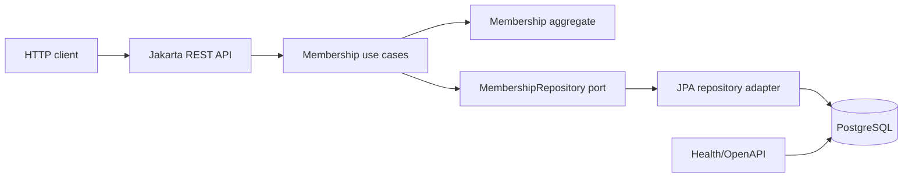
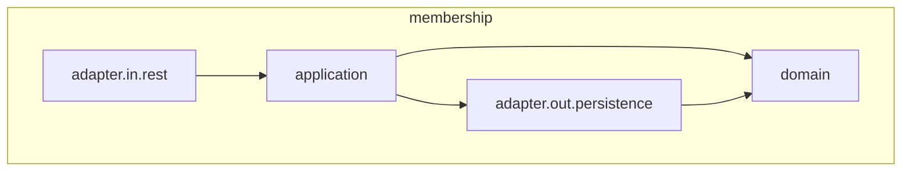
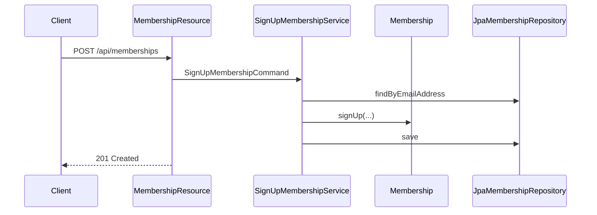

# Fitness Memberships Architecture

## 1. Introduction and Goals

Fitness Memberships is a small backend for managing the first membership milestone:

* sign up a membership;
* pause a membership;
* view one membership;
* list memberships for administration.

The system is intentionally a modular monolith. The main quality goals are clear business rules, testable domain logic, deterministic persistence, and Docker-based local operation.

## 2. Constraints

* Java 25, Jakarta EE 11, MicroProfile 7.1, Open Liberty, Maven Wrapper.
* PostgreSQL is the only datastore in development, tests, and Docker.
* Flyway owns schema migrations.
* No Spring, Lombok, frontend, messaging, CQRS, event sourcing, Kubernetes, H2, or fake authentication.

## 3. Context and Scope



Authentication and authorization are outside this milestone.

## 4. Solution Strategy

The implementation follows hexagonal architecture:

* domain objects enforce membership signup, pause, and effective-status rules;
* application services coordinate use cases and transactions;
* REST resources translate HTTP input/output;
* JPA adapters implement repository persistence;
* Flyway migrations create and evolve PostgreSQL schema.

## 5. Building-Block View



Primary packages:

* `membership.domain`: aggregate, value objects, domain exceptions.
* `membership.application`: use-case services, ports, page-size policy.
* `membership.adapter.in.rest`: public API and problem responses.
* `membership.adapter.out.persistence`: JPA entity, mapper, repository.
* `configuration`: JAX-RS application, clock, Flyway startup migration.
* `operations`: liveness and PostgreSQL readiness checks.

## 6. Runtime View

Signup:



Pause starts on the injected business date. `resumeOn` is exclusive: the membership is active again on the resume date.

## 7. Deployment View

Local deployment uses `compose.yaml`:

* `postgres`: PostgreSQL 18 with a persistent development volume.
* `app`: Open Liberty Java 25 image containing the built WAR and PostgreSQL driver.

Expected startup:

```bash
docker compose up --build
```

## 8. Cross-Cutting Concepts

* Effective status is derived from `pausedFrom`, `resumeOn`, and a supplied business date.
* `Clock` is injected into application and REST layers; domain logic receives dates explicitly.
* API errors use `application/problem+json`.
* Admin listing is sorted by activation date descending and ID ascending.
* PostgreSQL uniqueness protects normalized email against races.
* `@Version` provides optimistic locking.

## 9. Architectural Decisions

Decisions are maintained in `docs/architecture/decisions`.

## 10. Quality Requirements

* Domain tests run without CDI, Liberty, Docker, or a database.
* Persistence tests use PostgreSQL Testcontainers and Flyway.
* REST resources expose OpenAPI annotations.
* Migrations must be compatible with the JPA mapping.

## 11. Risks and Technical Debt

* Real admin authentication is deferred and must use MicroProfile JWT when implemented.
* REST integration tests are intentionally small and should be expanded when authentication and operational endpoints grow.
* Email validation is syntactic and intentionally conservative for the first milestone.

## 12. Glossary

* Membership: aggregate root.
* Membership ID: application-generated UUID.
* Email address: normalized unique email of the member.
* Plan code: supported membership plan, currently `STANDARD` or `PREMIUM`.
* Pause period: date range from `pausedFrom` inclusive to `resumeOn` exclusive.
* Resume date: first date on which the membership is active again.
* Effective status: `ACTIVE` or `PAUSED` calculated for a business date.
